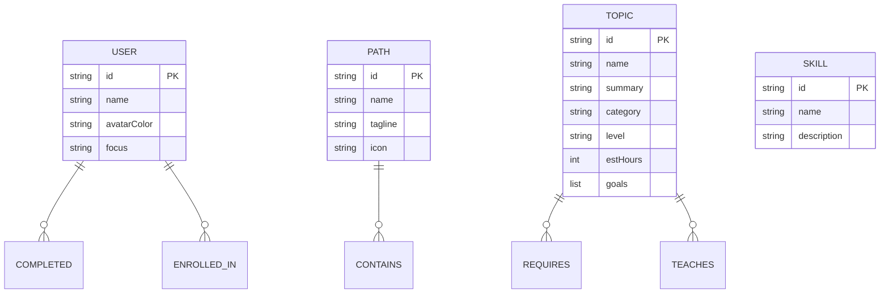

# Pathfinder — AI-Powered Learning Path Graph

A **graph database application** for Wexa AI's take-home assignment, built on **CognoDB**
(openCypher over Bolt). Pathfinder turns a network of learning topics, prerequisites and skills
into **personalised, ordered learning paths** — computed by traversing the graph, not by hand.

> "Learn anything, in the right order."

 -6366f1)  

---

## Table of contents

1. [The use case](#the-use-case)
2. [Why a graph database?](#why-a-graph-database)
3. [Data model](#data-model)
4. [Main queries](#main-queries)
5. [The "AI" — path generation algorithm](#the-ai--path-generation-algorithm)
6. [Tech stack](#tech-stack)
7. [Project structure](#project-structure)
8. [Setup & run](#setup--run)
9. [Seed data](#seed-data)
10. [API reference](#api-reference)
11. [Running the tests](#running-the-tests)
12. [Deployment (hosted demo)](#deployment-hosted-demo)
13. [Screenshots](#screenshots)

---

## The use case

People routinely Google "how to learn React" and get a flat list of links. The interesting
question isn't "what should I learn?" — it's **"what is the shortest ordered set of topics I need,
given what I already know?"** Learning has an inherent dependency structure: you can't learn React
without JavaScript, and you can't learn Deep Learning without linear algebra.

**Pathfinder** models that structure as a graph:

- **Topics** are nodes (e.g. `React`, `NumPy`, `Docker`).
- **`REQUIRES`** relationships encode prerequisites (`React -[:REQUIRES]-> JavaScript`).
- **Skills** are nodes that topics `TEACH`.
- **Paths** are curated routes that `CONTAIN` topics.
- **Learners** are nodes with `COMPLETED` relationships to topics they've finished.

A learner picks a goal (say *Deep Learning*), and Pathfinder:

1. walks the graph backwards to collect the **full prerequisite closure** (every topic you need),
2. filters out what the learner has already completed,
3. **topologically orders** the remainder so no topic appears before its prerequisites,
4. scores each topic by how many downstream topics it **unblocks**, and
5. recommends the best *next step* to start right now.

The result is a personalised route with status per topic (done / ready / locked), estimated hours,
and a "what to do next" suggestion — all derived from traversing relationships, not from hand-made
curricula.

---

## Why a graph database?

This problem is a graph problem. The value lives in the *connections between topics*, and the
questions that matter are **relationship questions**:

| Question | Relational (SQL) | Graph (Cypher) |
| --- | --- | --- |
| "Everything I need before Deep Learning" (transitive closure, arbitrary depth) | A recursive CTE with a fragile depth limit — or N self-joins you can't know in advance | One variable-length pattern: `MATCH (d:Topic)-[:REQUIRES*]->(t:Topic)` |
| "Topics I can start now" (all prerequisites completed) | Compute per-topic aggregate of completed prereqs via joins + `HAVING` | A natural predicate: `all(x IN t.prereqs WHERE x IN completed)` over a pattern |
| "Which skills block the most other topics" (2-hop demand) | Self-join the junction table twice; write it again when depth changes | `MATCH (b:Topic)-[:REQUIRES*1..2]->(p:Topic)-[:TEACHES]->(s:Skill)` |
| "Shortest path between two topics" | No standard answer; write BFS by hand | `MATCH p = shortestPath((a)-[:REQUIRES*]-(b))` |

A relational schema would need a `topics` table, a `topic_prerequisite` self-referencing junction
table, a `skills` table, and multiple join tables — and then the *queries that make this app
interesting* (transitive closure, "unlocks", shared prerequisites, demand) all become awkward,
length-limited recursive CTEs or N-way self-joins. **In a graph, each of those is a single
parameterised pattern that doesn't change when the data deepens.**

The app deliberately leans into two graph-only operations the evaluator can try on the live demo:

1. **Multi-hop traversal** — computing a complete prerequisite path to a goal of any depth.
2. **The "skills demand" query** — counting how many topics are *indirectly* blocked by a skill,
   a two-hop aggregate that is genuinely awkward in SQL.

The graph also makes shared prerequisites (e.g. *Git* required by all three career paths) a first
class citizen instead of duplicated rows.

---

## Data model

Five node labels, four relationship types:

```
(:User)-[:ENROLLED_IN]->(:Path)
(:Path)-[:CONTAINS {order}]->(:Topic)
(:Topic)-[:REQUIRES]->(:Topic)
(:Topic)-[:TEACHES]->(:Skill)
(:User)-[:COMPLETED {score, completedAt}]->(:Topic)
```

### Visual diagram

```
         ┌──────────┐  ENROLLED_IN   ┌─────────┐
         │   User   │──────────────▶│  Path   │
         └────┬─────┘                └────┬────┘
              │                           │
        COMPLETED                     CONTAINS {order}
              │                           │
              ▼                           ▼
         ┌────────────┐  REQUIRES   ┌──────────┐  TEACHES   ┌─────────┐
         │   Topic    │────────────▶│  Topic   │───────────▶│  Skill  │
         └────────────┘             └──────────┘            └─────────┘
            source REQUIRES target  (learn target before source)
```

### Mermaid (renders on GitHub)



### Node & relationship properties

Identifiers are namespaced by node type so the schema reads clearly in the
database (`Topic.id_topic`, `Path.id_path`, `Skill.id_skill`, `User.id_user`).
The API projects them back to a plain `id` so consumers always see `{ id, … }`.

| Entity | Key properties |
| --- | --- |
| `Topic` | `id_topic`, `name`, `summary`, `category`, `level` (`beginner`/`intermediate`/`advanced`), `estHours`, `goals[]` |
| `Skill` | `id_skill`, `name`, `description` |
| `Path` | `id_path`, `name`, `tagline`, `description`, `icon` |
| `User` | `id_user`, `name`, `avatarColor`, `focus` |
| `REQUIRES` | direction: `source` depends on `target` |
| `CONTAINS` | `order` (position within the path) |
| `COMPLETED` | `score`, `completedAt` |

The dataset ships with **37 topics, ~59 `REQUIRES` edges, 18 skills, 3 paths and 4 learners** — well
inside the free c0 tier, but rich enough to exercise deep prerequisite chains (e.g. *Deep Learning*
pulls in 9 prerequisites across 4 hops).

---

## Main queries

All queries live in `backend/src/queries/cypher.js` and are **100% parameterised** — no
string-concatenated Cypher anywhere. Highlights:

### 1. Multi-hop traversal — the full prerequisite closure

```cypher
MATCH (start:Topic { id_topic: $id })-[:REQUIRES*0..2]-(t:Topic)
RETURN DISTINCT t { id: t.id_topic, .name, .summary, .category, .level, .estHours } AS node
```

Used by the **neighbourhood map** on a topic page. `*0..N` is a variable-length relationship
pattern — a relational equivalent needs an unbounded recursive CTE. (CognoDB doesn't accept a
parameter inside the `*0..N` bound, so the code ships three fixed-depth variants for depths 2–4,
selected server-side — still no concatenation.)

### 2. Path generation (multi-hop, done in the engine)

```cypher
MATCH (t:Topic)
OPTIONAL MATCH (t)-[:REQUIRES]->(pr:Topic)
RETURN t { id: t.id_topic, .name, .summary, .category, .level, .estHours } AS topic,
       collect(pr.id_topic) AS requires
```

The engine (`backend/src/services/pathEngine.js`) then computes the transitive prerequisite closure
over this edge list, orders it topologically, and scores unlock potential. The closure is the
multi-hop graph operation; the ordering/scoring is pure, unit-tested logic.

### 3. Skills demand — the relational-awkward query

```cypher
MATCH (t:Topic)-[:TEACHES]->(s:Skill)
WITH s, collect(DISTINCT t.id_topic) AS taughtBy
OPTIONAL MATCH (blocked:Topic)-[:REQUIRES*1..2]->(pr:Topic)-[:TEACHES]->(s)
WHERE NOT blocked.id_topic IN taughtBy
RETURN s { id: s.id_skill, .name, .description } AS skill,
       size(taughtBy) AS taughtByCount,
       count(DISTINCT blocked) AS demandCount
ORDER BY demandCount DESC, taughtByCount DESC
```

*"How many topics are indirectly blocked because they need a skill?"* — a two-hop aggregate that in
SQL would be a self-join over a junction table with no clean bound on depth.

### 4. Shared prerequisites across two topics

A natural set-intersection over patterns that would be several joins in SQL:

```cypher
MATCH (a:Topic { id_topic: $a })-[:REQUIRES]->(shared)<-[:REQUIRES]-(b:Topic { id_topic: $b })
RETURN shared { id: shared.id_topic, .name }
```

---

## The "AI" — path generation algorithm

The recommendation engine is a small, explainable graph algorithm in
`backend/src/services/pathEngine.js`. It is deliberately **pure** (no I/O) so it is fully unit
tested. Given a target and the learner's completed set it:

1. **Closure** — walks `REQUIRES` edges transitively to collect every needed topic
   (`prerequisiteClosure`).
2. **Ordering** — assigns each topic a *depth* = the longest prerequisite chain ending at it
   (`computeDepths`), so fundamentals come first; ties broken by unlock score.
3. **Unlock score** — counts how many topics in the generated path a topic directly unblocks, so
   "bottleneck" topics surface as the recommended next step (`suggestNext`).

The result is deterministic and explainable: every recommendation can be justified by graph
topology. Tests in `backend/test/pathEngine.test.js` cover closure, ordering, completion handling
and next-step suggestions.

---

## Tech stack

| Layer | Choice |
| --- | --- |
| Database | [CognoDB](https://console.cognodb.com) — openCypher over Bolt 5.x, official `neo4j-driver` |
| Backend | Node.js 22 + Express 5, ESM |
| Frontend | React 18 + Vite 6, React Router, React Flow (`@xyflow/react`), lucide-react |
| Tests | Node's built-in test runner (`node --test`) |

---

## Project structure

```
.
├── backend/
│   ├── src/
│   │   ├── index.js              # entry point (boot, shutdown hooks)
│   │   ├── app.js                # Express app wiring
│   │   ├── config.js             # env config + validation
│   │   ├── db/driver.js          # Neo4j/CognoDB driver, health ping
│   │   ├── queries/cypher.js     # all parameterised Cypher statements
│   │   ├── lib/record.js         # driver record → plain JSON
│   │   ├── middleware/errorHandler.js
│   │   ├── routes/               # health, catalog, graph, paths, users
│   │   └── services/             # catalog, user, path service + pathEngine
│   ├── scripts/
│   │   ├── seed.js               # idempotent data loader (--reset option)
│   │   └── seedData.js           # the dataset
│   ├── test/pathEngine.test.js   # 7 unit tests for the recommender
│   ├── .env.example
│   └── package.json
└── frontend/
    ├── src/
    │   ├── App.jsx               # routing + DB-health gate
    │   ├── api/client.js         # typed API wrapper
    │   ├── hooks/useApi.js       # loading/error/data hook
    │   ├── components/           # AppShell, GraphCanvas, States, PathIcon
    │   ├── lib/                  # layered graph layout, formatting
    │   ├── pages/                # 9 pages
    │   └── styles/global.css
    ├── index.html
    ├── vite.config.js            # dev proxy /api → :4000
    └── package.json
```

---

## Setup & run

### 1. Create a free CognoDB instance

1. Go to https://console.cognodb.com/signup and create an account (free tier, no credit card).
2. In the console, create a free **c0** instance and pick a region. It provisions in under a minute.
3. Copy the connection details: a URI of the form
   `bolt+s://<instance-id>.databases.cognodb.cloud`, username `cognodb`, and the generated password.
   **The password is shown exactly once — save it immediately.**

### 2. Configure the backend

```bash
cd backend
cp .env.example .env
```

Then edit `backend/.env`:

```ini
NEO4J_URI=bolt+s://<instance-id>.databases.cognodb.cloud
NEO4J_USER=cognodb
NEO4J_PASSWORD=<the-generated-password>
PORT=4000
FRONTEND_ORIGIN=http://localhost:5173
JWT_SECRET=<long-random-string>   # e.g. openssl rand -hex 48
JWT_EXPIRES_IN=7d
```

> `.env` is git-ignored. Only `.env.example` with placeholders is committed.

### 3. Install & load the seed data

```bash
cd backend
npm install
npm run seed          # idempotent — safe to re-run
# or: npm run seed:reset   to wipe the graph first
```

### 4. Run the backend

```bash
cd backend
npm run dev           # http://localhost:4000
```

### 5. Run the frontend

```bash
cd frontend
npm install
npm run dev           # http://localhost:5173
```

Open http://localhost:5173. The Vite dev server proxies `/api` to the backend, so no CORS setup is
needed locally.

**Note on graceful degradation:** if the backend can't reach the database (wrong credentials,
instance paused, env missing), the API returns clean `503` JSON and the UI shows a friendly
"Database is offline" screen with setup instructions and a retry button — the app never crashes.

---

## Seed data

`npm run seed` loads (idempotently, via `MERGE` on stable ids):

- **37 topics** across *Web Development*, *Data Science & ML* and *Backend Engineering*, each with
  level, estimated hours and learning goals.
- **59 `REQUIRES`** prerequisite edges, including deep chains and cross-domain shared topics
  (*Git*, *SQL*, *Node.js*, *Python* appear in multiple paths).
- **18 skills** with `TEACHES` relationships.
- **3 learning paths** (Web Developer, Data Scientist, Backend Engineer) with ordered `CONTAINS`
  relationships.
- **4 learners** with realistic `COMPLETED` progress to power the personalised generator. Each seed
  learner is also an **account** you can sign in with (email + password are hashed with bcrypt and
  stored as `passwordHash` on the `User` node — plaintext is never persisted).

---

## Authentication

Learners are real accounts. Browsing is public; **signing in** personalises path generation and
lets you save progress back to the graph (`COMPLETED` edges on your own `User` node).

- `POST /api/auth/register` — create an account (name, email, password ≥ 8 chars). Returns
  `{ user, token }`. Your new learner node appears in the graph immediately.
- `POST /api/auth/login` — returns `{ user, token }` (JWT, 7-day expiry).
- `GET /api/auth/me` — restores the session; takes `Authorization: Bearer <token>`.
- Protected: `POST /api/users/:id/progress` requires a valid token **and** `:id` must be your own
  user (403 otherwise). `POST /api/paths/generate` falls back to your account when no `userId` is
  sent.

Tokens are sent via `Authorization: Bearer` and kept in `localStorage` by the frontend.

### Demo accounts

Every seed learner can sign in with password `password123`:

| Email | Learner | Progress |
| --- | --- | --- |
| `amelia@example.com` | Amelia Chen | Frontend · 3 topics done |
| `bima@example.com` | Bima Putra | Data science · 3 topics done |
| `ciara@example.com` | Ciara O'Brien | Backend · 4 topics done |
| `guest@example.com` | Guest Learner | none |

The login page includes one-click buttons that pre-fill these credentials. If
`JWT_SECRET` is missing, auth endpoints respond `503 AUTH_NOT_CONFIGURED` instead of
crashing.

---

## API reference

| Method | Endpoint | Purpose |
| --- | --- | --- |
| GET | `/api/health` | DB connectivity + node/relationship counts (200 or 503) |
| GET | `/api/catalog/stats` | Global node & relationship totals |
| GET | `/api/catalog/paths` | List learning paths |
| GET | `/api/catalog/paths/:id` | Path detail with ordered topics + prerequisites |
| GET | `/api/catalog/topics` | List/search topics (`search`, `category`) |
| GET | `/api/catalog/topics/categories` | Distinct categories |
| GET | `/api/catalog/topics/:id` | Topic detail: prereqs, unlocks, skills, paths |
| GET | `/api/catalog/topics/:id/subgraph` | Multi-hop neighbourhood (2–4 hops) |
| GET | `/api/catalog/skills?demand=true` | Skills with taught-by + blocked-topics demand |
| GET | `/api/catalog/graph` | Full topic graph (`topics` + `edges`) |
| POST | `/api/paths/generate` | Generate personalised path `{targetId, userId?}` (authed fallback) |
| POST | `/api/auth/register` | Create account → `{user, token}` |
| POST | `/api/auth/login` | Sign in → `{user, token}` |
| GET | `/api/auth/me` | Current user (Bearer token) |
| GET | `/api/users` | List learners |
| GET | `/api/users/:id` | Learner progress (completed topics, enrolled paths) |
| POST | `/api/users/:id/progress` | Mark a topic complete `{topicId, score?}` (auth required, own user only) |

Try the core one:

```bash
curl -X POST http://localhost:4000/api/paths/generate \
  -H "Content-Type: application/json" \
  -d '{"targetId":"ds-dl","userId":"user-bima"}'
```

---

## Running the tests

```bash
cd backend
npm test
```

12 tests cover the path engine (transitive prerequisite closure, topological ordering,
completed-topic handling, readiness and next-step suggestions) plus the auth helpers (email/password
validation, bcrypt hashing and JWT sign/verify).

---

## Deployment (hosted demo)

The backend and frontend build independently and can be hosted on any free tier:

- **Backend** — Render / Railway / Fly.io. Set `NEO4J_URI`, `NEO4J_USER`, `NEO4J_PASSWORD` as
  environment variables (never in the repo). Serve the API on port `PORT`.
- **Frontend** — Vercel / Netlify. Build with `npm run build` (static files in `dist/`), set
  `VITE_API_BASE` to the hosted backend URL, and configure a rewrite so `/api/*` forwards to the
  backend (or point `VITE_API_BASE` at the backend directly).

> Live demo link & screen recording: added to this README before submission.

---

## Screenshots

*Screenshots of the dashboard, generator and graph explorer are added here before submission.*

---

## Assignment notes

- **Credentials** are read from environment variables and never committed.
- **All Cypher is parameterised** via the official `neo4j-driver`; no string interpolation.
- **Graceful error handling**: every API error maps to structured JSON; the UI has loading, empty
  and error states for every page.
- **Graph earns its place**: transitive prerequisite closure, unlock scoring and two-hop skill
  demand are native patterns in Cypher but genuinely awkward in SQL.
